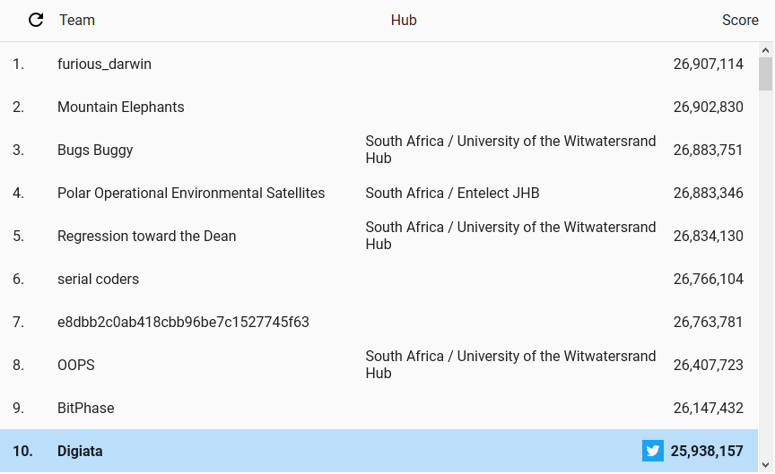

# 2020 Google Hash Code Online Qualification Round
My team's entry for the Online Qualification round of the Google Hash Code competition 2020. The solution was implemented as a Visual Studio project in C#. The problem statement can be downloaded [here](https://hashcodejudge.withgoogle.com/download/blob/AMIfv959xJ1YALdhKmw2Ms2bbm-d4C66GQfYcihkUg78TC-8gy64u4n5smSMtoH_EcvFECp2tsGiMGkVjCsH__AsoXBedT52PLY55nKs-YI2qYTblmjc68ELngZPxNKJU7jcmbVsx5OY6MFqA0umlWyxgyRir4jZTCPiCUUnzIBq2SfT0I7RuHQbSazavev043SFA49HzuvIBNYPtAWlAn2zdeEfcr0WujM5XLj9cbAi7lPqpaNeHuAkKxWZouF5PE7F4REjtycuGiJ48yhydw39g4iNIqbNNfGPnUqb02Aiv5dtFSgS-41UtqFRY3nFriizoz9cG_Ei).

Our team for the contest was "Digiata" consisting of the following members:

- Bernhard Häussermann
- Linda Potgieter
- Taariq Ghoord

In the contest our team was ranked 1440 / 10724 globally, and 10 / 107 in South Africa. Below is the top-ten list for South Africa:

